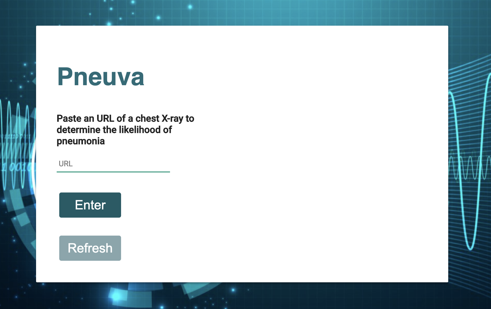

# Pneuva
An application to determine the likelihood that an xray photo of lungs has pneumonia. Url link of image is entered, and then sent to trained model (using Azure). API sends back percentage xray has pneumonia.

Dataset found on Kaggle: https://www.kaggle.com/paultimothymooney/chest-xray-pneumonia
Microsoft Azure: https://azure.microsoft.com/en-ca/services/machine-learning/

  